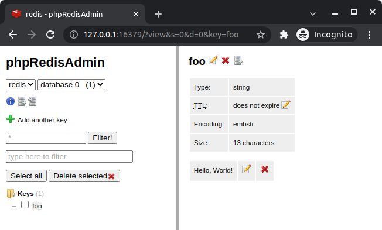

# Docker Redis

## Setup

```
git clone git@github.com:amberlex78/docker-redis.git
cd docker-redis
make init
```

## Log into container
```
docker-compose exec redis redis-cli
```
```
127.0.0.1:6379>
```
Or `make run` and type `exit` for exit container
```
make run 
```
```
127.0.0.1:6379> exit
```

## In docker container

For example:
```
127.0.0.1:6379> SET foo "Hello, World!"
OK

127.0.0.1:6379> GET foo
"Hello, World!"
```

## GUI phpRedisAdmin
```
http://127.0.0.1:16379
```


